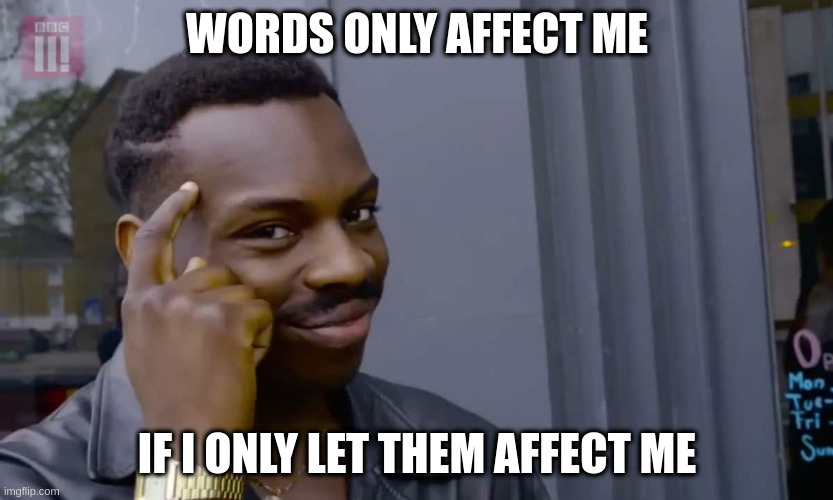

# Core Principles

- Not going to be written as an essay here. 
- Keep this just like a technical blog, where would one like to 
jump directly to the code.

## Become a Stoic - Practical 101

A great read-through presented by [The DailyStoic website by Ryan Holiday][1]
is just what us _attention-lacking_ people need

### Dichotomy of Control

> Determine what is in our control and what is not. Ask oneself this question 
> again and again and let the answer decide your actions and outcomes

### Journal Often

> Write it down. Type it down. An essay or just a word
> Prepare your goals beforehand so as not to distract yourself from what you
> want to achieve on the day

### Let those negative thoughts in and live them, but don't let them stay!

> Make yourself accustomed to your worst-case scenarios, if you have lived them
> in your brain, you might have suffered more than in reality.

Repeat after me:

> We suffer more in imagination than in reality

### Don't let it get to you!

> Choose not to be harmed and you won’t feel harmed. Don’t feel harmed and you haven’t been.
>       - Marcus Aurelius

Don't let yourself feel hurt. Remember that meme:

### Ash to Ash, Dust to Dust

Just like that Metallica Lyrics

> In the grand scheme of things, nothing is going to matter in the longer run

### _Memento Mori_

Absolute Gospel

> You may leave the face of this Earth in this very moment.
> Let this inevitability define what you wish to do, say and react

If you think somethings need to change, like the great _Shia LeBeouf_ quote

> DO IT! JUST DO IT!

### Be ready for things to go down south!

> Not everything can be hunky dory, all day everyday.
> Sharpen your skills for the worst-case scenario too!

#### _Amor Fati_

Absolute Gospel number 2

> Love and accept the blow of Fate that was dealt to you!

You can cry about it if you like, but nothing is going to change unless you
accept it, embrace it and smile at it thanking it that it has given you a chance
to experience something and has helped you into becoming a better human

It's like gaining __XP__ (experience points) even if you failed a mission in a game!

[1]: https://dailystoic.com/what-is-stoicism-a-definition-3-stoic-exercises-to-get-you-started/#how-to-be-a-stoic